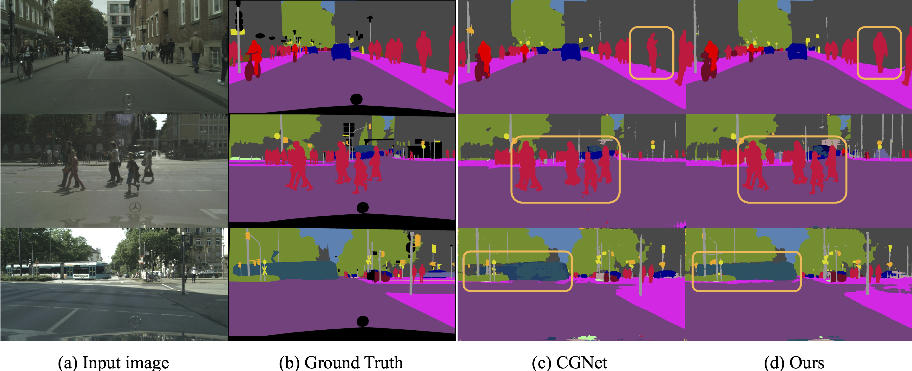

# Graph-Lightweight-SemSeg
A Graph-involved Lightweight Semantic Segmentation Network

Results on Cityscapes val set
| Methods| Resolutions | mIoU(%) | Params |
| :-----| :----: | :----: | :----: |
| ENet | $2048\times1024$ | 58.3 | 0.4 |
| SegNet | $2048\times1024$ | 57.0 | 29.5 |
| ESPNetv1 | $2048\times1024$ | 60.3 | 0.4 |
| CGNet | $2048\times1024$ | 63.5 | 0.5 |
| Lightset-Shuffle | $2048\times1024$ | 66.1 | 3.5 |
| DGCNet(Res101) | $2048\times1024$ | 80.5 | 72.5 |
| WaveMix- | $512\times256$ | 63.3 | 2.9 |
| SegFormer(B0) | $1024\times512$ | 62.6 | 7.7 |
| PPL-LCNe | $1024\times512$ | 66.0 | 3.0 |
| TopFormer-Tiny | $1024\times512$ | 66.1 | 1.4 |
| MGD | $800\times800$ | 62.6 | 1.8 |
| Ours | $2048\times1024$ | 66.8 | 1.5 |

Visualization on Cityscapes val set.


```
Xue Xia, Jiayu You, Yuming Fang. A Graph-involved Lightweight Semantic Segmentation Network. PRCV2023, Accepted.
```

This work was inspired by ```[CGNet: A Light-weight Context Guided Network for Semantic Segmentation](https://github.com/wutianyiRosun/CGNet.)``` and ```[Dual Graph Convolutional Network for Semantic Segmentation](https://github.com/lxtGH/GALD-DGCNet)```
